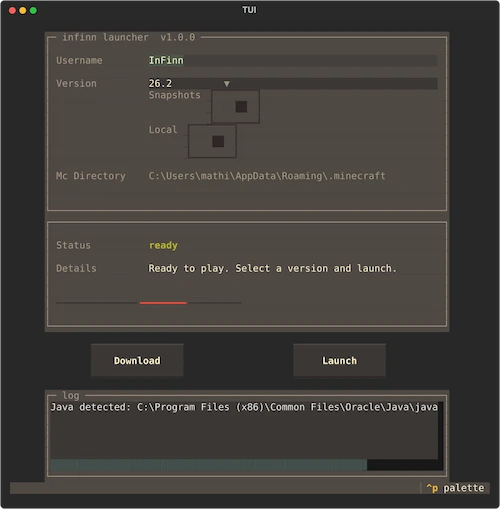

# infinn launcher



A minimal, terminal-based Minecraft launcher built with Python and [Textual](https://textual.textualize.io/). Browse, download, and launch Minecraft versions right from your terminal — no mouse required.


## Features

- **Terminal UI** powered by Textual with a clean, keyboard-friendly layout.
- **Version browser** — list official Mojang releases, snapshots, or only locally installed versions.
- **One-click download** of any Minecraft version via `minecraft_launcher_lib`, with live progress.
- **Launch** the selected version with an offline-style username.
- **Java detection** — auto-locates Java from `PATH`, the Windows registry, or common install dirs, and blocks launching if missing.
- **Internet check** on startup with clear status feedback.
- **Persistent preferences** — remembers your Minecraft directory, last version, username, window size, and Java path in `src/cache.json`.
- **Cross-platform** path handling (tested on Windows).

## Requirements

- Python **3.11.9**
- A working **Java** installation (needed to actually launch the game)
- An internet connection (to fetch the version manifest and download game files)

## Installation

Clone the repository and install the dependencies:

```bash
git clone https://github.com/your-username/minecraft-tui-launcher.git
cd minecraft-tui-launcher
pip install -r requirements.txt
```

`requirements.txt` contains:

- `Textual`
- `minecraft_launcher_lib`
- `requests`

## Usage

Run the launcher from the project root:

```bash
python main.py
```

### Controls

| Element            | Description                                                        |
| ------------------ | ------------------------------------------------------------------ |
| **Username**       | Offline username used when launching the game.                     |
| **Version**        | Select the Minecraft version to download/launch.                   |
| **Snapshots**      | Toggle to include snapshot versions in the list.                  |
| **Local**          | Toggle to show only versions already installed locally.           |
| **Mc Directory**   | The `.minecraft` directory currently in use.                       |
| **Download**       | Downloads the selected version from Mojang.                        |
| **Launch**         | Launches the selected version (disabled until Java is detected).   |

Status, details, and a live log are shown in the lower panels. Buttons are disabled while an operation is in progress.

## Configuration & Data

- `src/cache.json` — auto-generated at runtime; stores user preferences and is gitignored.
- `<minecraft_dir>/configuration-launcher.json` — auto-created launcher profile (username, JVM arguments, resolution, etc.). The directory defaults to `%APPDATA%/.minecraft` on Windows and `~/.minecraft` elsewhere.

## Building a standalone executable (optional)

A PyInstaller spec is provided (`main.spec`). Assets under `image/`, `src/font/`, and `logo.ico` are optional and must be supplied externally — the build will still succeed without them.

```bash
pip install pyinstaller
pyinstaller main.spec
```

The resulting binary is written to `dist/`.

## Project Structure

```
main.py                       Entry point
src/tui.py                    Textual App — UI layout & interactions
src/tui.tcss                  Textual stylesheet
src/state.py                  Centralized UI state (versions, java, progress)
src/utils.py                  Install/launch helpers, config & Java detection
src/profile.py                Launch profile model (serialization)
src/Globals.py                Shared singleton state & cache management
src/core/version_collection.py  Mojang manifest fetching & version listing
```

## Roadmap

Future ideas (see `ROADMAP.md` for the full plan):

- Multiple profile management
- Server quick-connect list
- Resource pack selector
- Launcher auto-update check

## License

This project is not affiliated with Mojang or Microsoft. Minecraft is a trademark of Mojang Studios.
